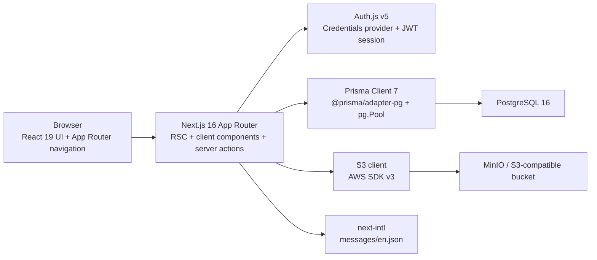
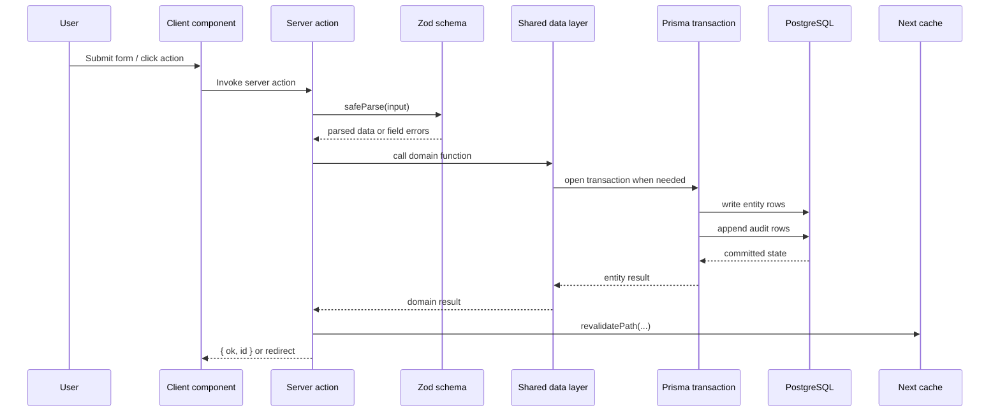
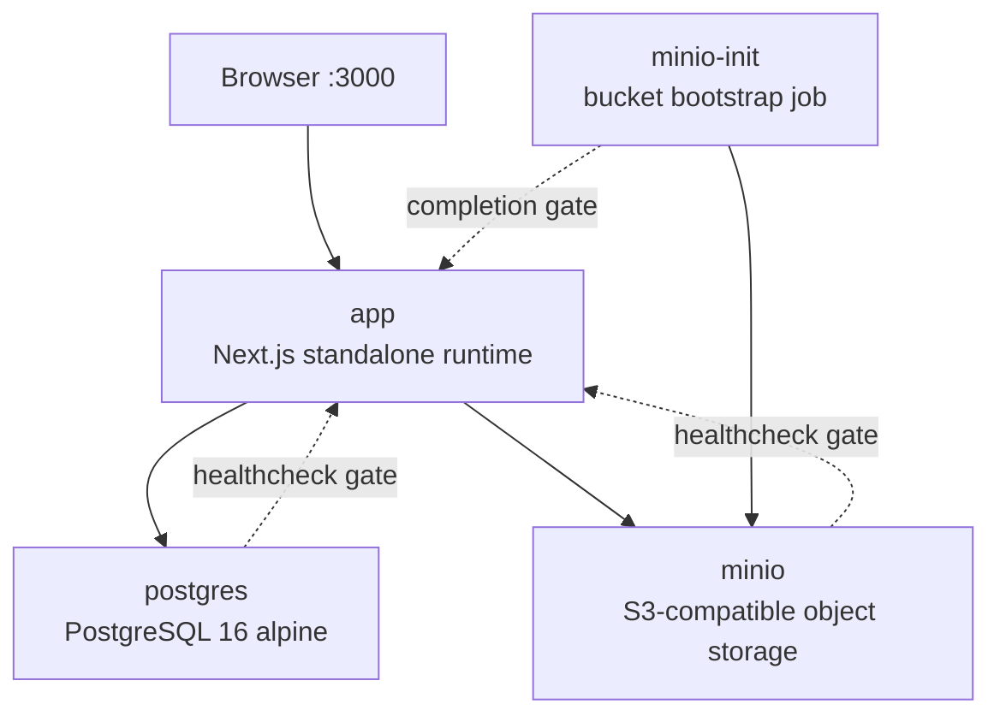
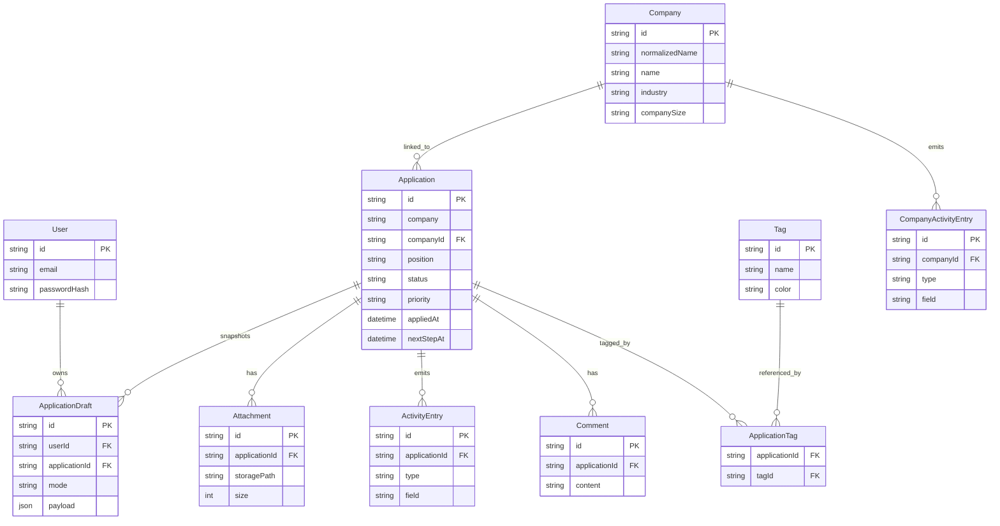
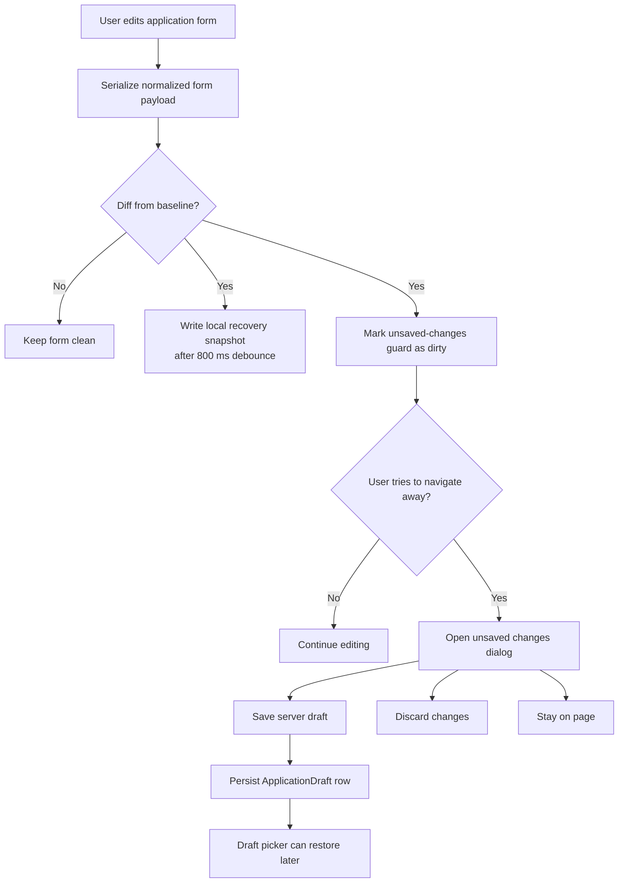
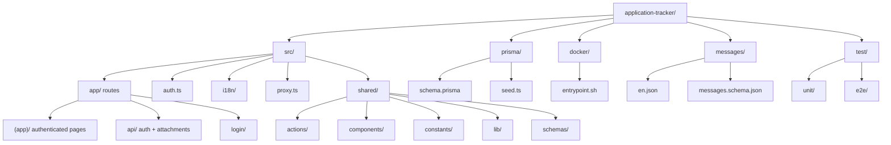
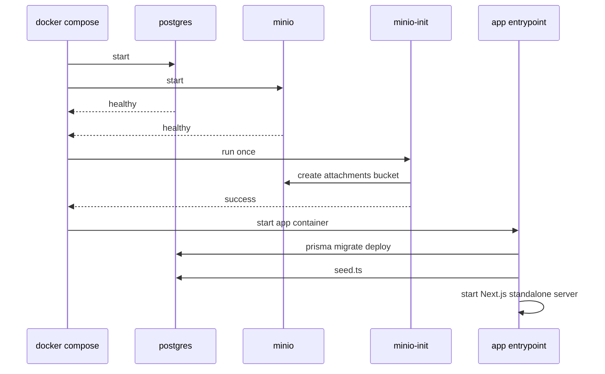

# Application Tracker

Application Tracker is a self-hosted job search operating system built with **Next.js 16 App Router**, **React 19**, **Prisma 7**, **PostgreSQL**, **Auth.js v5 credentials auth**, and **MinIO / S3-compatible object storage**. The project is optimized for running as a single private deployment with `docker compose`, while still keeping the internal architecture explicit: typed server actions, transactional entity writes, append-only audit logs, draft persistence, and strongly validated forms.

## Table of Contents

- [Overview](#overview)
- [Feature Set](#feature-set)
  - [Application lifecycle tracking](#application-lifecycle-tracking)
  - [Company intelligence and bidirectional linkage](#company-intelligence-and-bidirectional-linkage)
  - [Attachments and controlled downloads](#attachments-and-controlled-downloads)
  - [Drafts local recovery and unsaved change guards](#drafts-local-recovery-and-unsaved-change-guards)
  - [Reference data management](#reference-data-management)
  - [Dashboard and activity surfaces](#dashboard-and-activity-surfaces)
  - [Localization and validation first UX](#localization-and-validation-first-ux)
- [Architecture](#architecture)
  - [System context](#system-context)
  - [Mutation lifecycle](#mutation-lifecycle)
  - [Container topology](#container-topology)
  - [Domain relationships](#domain-relationships)
  - [Draft persistence lifecycle](#draft-persistence-lifecycle)
- [Technology Stack](#technology-stack)
  - [Runtime stack](#runtime-stack)
  - [Developer tooling](#developer-tooling)
- [Repository Layout](#repository-layout)
- [Execution Model](#execution-model)
  - [Rendering boundaries](#rendering-boundaries)
  - [Server action pattern](#server-action-pattern)
  - [Filtering and query model](#filtering-and-query-model)
- [Quick Start with Docker Compose](#quick-start-with-docker-compose)
  - [Bootstrap sequence](#bootstrap-sequence)
- [Local Development](#local-development)
  - [Package scripts](#package-scripts)
- [Environment Variables](#environment-variables)
- [Database and Persistence Model](#database-and-persistence-model)
  - [Schema management](#schema-management)
  - [Seeded bootstrap data](#seeded-bootstrap-data)
- [Authentication and Route Protection](#authentication-and-route-protection)
- [Storage and Attachment Delivery](#storage-and-attachment-delivery)
- [Internationalization](#internationalization)
- [Testing and CI](#testing-and-ci)
- [Common Operations](#common-operations)
- [Troubleshooting](#troubleshooting)
- [License](#license)

## Overview

The application tracks the full lifecycle of a job search across three primary surfaces:

1. **Applications** - the operational record for each role, including status, compensation, source, contacts, attachments, next actions, and notes.
2. **Companies** - a first-class entity that can be created directly or auto-bootstrapped from application form data.
3. **Activity history** - append-only audit streams for both applications and companies, allowing field-level reconstruction of important changes.

The codebase leans on a clear boundary split:

- `src/app/**` contains routes, layouts, and feature-local UI.
- `src/shared/actions/**` and `src/app/**/actions/**` expose server actions.
- `src/shared/lib/**` owns database access, transactions, normalization, and audit generation.
- `prisma/schema.prisma` is the source of truth for persistence.

## Feature Set

### Application lifecycle tracking

The application form models much more than a basic company + title pair. The persisted `Application` record includes:

- job identity: `position`, `company`, `listingDetails`, `jobUrl`
- workflow state: `status`, `priority`, `nextActionType`, `nextStepAt`, `nextStepNote`, `outcomeReason`
- compensation: `salaryMin`, `salaryMax`, `targetSalaryMin`, `targetSalaryMax`, `currency`
- discovery metadata: `source`, `sourceType`, `applicationMethod`, `referralName`
- work context: `location`, `workMode`, `employmentType`, `team`, `department`
- eligibility context: `needsSponsorship`, `relocationPreference`, `workAuthorizationNote`, `timezoneOverlapHours`, `officeDaysPerWeek`
- contact package: recruiter / hiring contact details, resume version, cover letter version, portfolio URL
- content fields: Markdown notes plus many-to-many tags

Validation is centralized in [`src/shared/schemas/application.ts`](src/shared/schemas/application.ts). That schema enforces:

- required company and position
- valid URLs and emails
- numeric range guards
- closed-status-only outcome reasons
- referral name only when `sourceType === REFERRAL`
- consistency between sponsorship flags and work authorization notes

The listing surface parses typed URL filters through [`src/shared/lib/parseFilters.ts`](src/shared/lib/parseFilters.ts) and converts them into Prisma `where` conditions through [`src/shared/lib/applications.ts`](src/shared/lib/applications.ts). Supported filters cover search text, status, work mode, priority, source type, relocation preference, company size, application method, sponsorship, next action type, outcome reason, tag IDs, date range, and sort order.

### Company intelligence and bidirectional linkage

Companies are not just labels attached to applications. The `Company` model stores identity, location, online presence, business context, culture, contacts, and private tracking notes in a dedicated table.

Important behavior:

- companies are deduplicated by `normalizedName`
- application creation can auto-create a company when no matching company exists
- company edits sync `name`, `industry`, and `companySize` back into linked applications
- company detail pages expose overview, linked applications, and company activity history
- company activity has its own audit stream separate from application activity

This makes the project closer to a lightweight CRM for job search operations than a simple application list.

### Attachments and controlled downloads

Attachments are stored as object metadata in PostgreSQL and binary blobs in S3-compatible storage. The upload path in [`src/shared/actions/attachments.ts`](src/shared/actions/attachments.ts):

1. validates file existence and `UPLOAD_MAX_BYTES`
2. generates a random UUID
3. sanitizes the original filename
4. stores the object under `<applicationId>/<uuid>__<safeName>`
5. creates an `Attachment` row
6. writes an `ATTACHMENT_ADDED` activity entry

Download requests go through [`src/app/api/attachments/[id]/route.ts`](src/app/api/attachments/[id]/route.ts), which requires an authenticated session, resolves the attachment record, fetches the object from S3, and streams it back with preserved MIME type and `Content-Disposition`.

### Drafts local recovery and unsaved change guards

Application forms have two persistence layers:

- **server-side drafts** in `ApplicationDraft`
- **browser-side recovery snapshots** in `localStorage`

The draft system supports both create and edit modes, carries a schema version, and stores `baseApplicationUpdatedAt` so edit drafts can be marked stale when the underlying application has changed.

Technical behavior from [`src/shared/lib/application-draft.ts`](src/shared/lib/application-draft.ts) and [`useApplicationDraft.ts`](<src/app/(app)/applications/components/ApplicationForm/hooks/useApplicationDraft.ts>):

- local recovery debounce: **800 ms**
- per-context server draft limit: **20**
- dirty-state detection uses normalized serialized payloads
- navigation interception works for internal links, browser unload, and router transitions
- the unsaved-changes dialog can discard, stay, or save a draft before leaving

### Reference data management

Three reference-data modules are managed in-app:

- **Tags** - color-coded labels linked through the `ApplicationTag` join table
- **Sources** - reusable source options used by application records
- **Currencies** - user-managed currencies with `usdRate`, `rateSource`, and `isDefault`

Currency handling is more than static lookup:

- USD is always treated as the default fallback rate `1`
- new currencies attempt a live USD conversion fetch through `https://api.frankfurter.app/latest`
- when the API has no rate, the UI can store a manual USD rate
- one currency is always marked as default

### Dashboard and activity surfaces

The dashboard route at [`src/app/(app)/page.tsx`](<src/app/(app)/page.tsx>) aggregates:

- total application count
- active application count
- applications created this week
- interview count
- status distribution
- upcoming next steps
- recent activity

The global activity page pages through `ActivityEntry` rows ordered by `createdAt desc, id desc`, while individual application and company detail pages expose local timelines beside the main record.

### Localization and validation first UX

The UI is wired through `next-intl`, but the implementation is intentionally strict and single-locale for now:

- locale list: `["en"]`
- default locale: `en`
- request time zone: `UTC`
- message catalog: [`messages/en.json`](messages/en.json)
- message shape validation: [`messages/messages.schema.json`](messages/messages.schema.json)

Validation errors returned by server actions are usually message keys rather than user-facing literals, so the form layer can translate them consistently.

## Architecture

### System context



The core request path stays inside a single Next.js runtime. REST-style handlers exist only for Auth.js and attachment download. Everything else is modeled as server components plus server actions.

### Mutation lifecycle



The pattern is consistent across applications, companies, drafts, currencies, sources, tags, and login actions:

- parse early
- return structured error keys on validation failure
- keep Prisma work in shared library modules
- revalidate the exact routes that depend on mutated data

### Container topology



`docker-compose.yml` defines four services:

- `postgres` for relational state
- `minio` for attachment blobs
- `minio-init` for creating the `attachments` bucket
- `app` for the built Next.js runtime

### Domain relationships



Two details are easy to miss:

- `source` and `currency` are stored on `Application` as strings, not foreign keys
- enum-like values are stored as strings and validated in Zod rather than Prisma enums

That choice keeps schema changes cheap and filtering simple, while reference tables still support controlled option management in the UI.

### Draft persistence lifecycle



## Technology Stack

### Runtime stack

| Layer              | Choice                                               |
| ------------------ | ---------------------------------------------------- |
| Web framework      | Next.js 16.2.4 App Router                            |
| UI runtime         | React 19.2.4 + React DOM 19.2.4                      |
| UI components      | Radix Themes 3.3 + Radix Icons                       |
| Forms              | React Hook Form 7 + `@hookform/resolvers`            |
| Validation         | Zod 4                                                |
| i18n               | next-intl 4.9                                        |
| ORM                | Prisma 7.7 with `@prisma/adapter-pg`                 |
| Database driver    | `pg` Pool                                            |
| Authentication     | Auth.js / NextAuth v5 beta with Credentials provider |
| Password hashing   | bcryptjs                                             |
| Object storage     | MinIO or any S3-compatible endpoint via AWS SDK v3   |
| Markdown rendering | react-markdown + remark-gfm                          |
| Client state       | Zustand 5 for local UI state                         |

### Developer tooling

| Area                     | Tooling                                                        |
| ------------------------ | -------------------------------------------------------------- |
| Formatter and linter     | Biome 2.4                                                      |
| Type checking            | TypeScript 5                                                   |
| Unit tests               | Vitest + Testing Library + jsdom                               |
| E2E tests                | Playwright                                                     |
| Containerized test infra | Testcontainers                                                 |
| Build pipeline           | Bun for install/test scripts, Node 22 for build/runtime images |
| CI                       | GitHub Actions                                                 |

## Repository Layout



## Execution Model

### Rendering boundaries

The application is mostly server-rendered:

- route pages use async server components for database reads
- interactive form sections, tables, dialogs, and guard logic use client components
- the authenticated shell wraps everything in `AppShell` and `UnsavedChangesShell`

This keeps data-fetching close to the route while limiting client-side state to places that need browser APIs or fine-grained interaction.

### Server action pattern

The dominant mutation pattern is:

1. create a `"use server"` action file
2. validate raw input with Zod or simple guards
3. call shared domain logic in `src/shared/lib`
4. wrap related writes in Prisma transactions
5. append activity rows when a tracked entity changed
6. call `revalidatePath` for affected list/detail/edit routes

Examples:

- [`src/shared/actions/applications.ts`](src/shared/actions/applications.ts)
- [`src/app/(app)/companies/actions/companies.ts`](<src/app/(app)/companies/actions/companies.ts>)
- [`src/app/(app)/currencies/actions/currencies.ts`](<src/app/(app)/currencies/actions/currencies.ts>)

### Filtering and query model

`parseFilters()` turns search params into a typed `ListFilters` object. `buildWhere()` then produces a Prisma filter object.

This gives the list page a stable server-side query model:

- filter state is URL-addressable
- server and UI agree on field names
- tag filters become relation filters (`tags.some.tagId`)
- date filters become `appliedAt.gte/lte`

## Quick Start with Docker Compose

Prerequisites:

- Docker 24+
- Docker Compose plugin

```bash
cp .env.example .env
# Fill every value in .env before first boot, especially secrets and passwords

docker compose up --build -d
```

The app listens on container port `3000`.

The Compose file reads only credential and bootstrap values from environment variables. In Coolify, define the same variables from `.env.example` in the service environment and route traffic to the `app` service on port `3000`. The app derives its internal PostgreSQL connection string from `POSTGRES_USER`, `POSTGRES_PASSWORD`, and `POSTGRES_DB`; PostgreSQL, MinIO, and the app port stay internal unless you add explicit port mappings.

### Bootstrap sequence



Docker-specific implementation details:

- `Dockerfile` uses Bun in the dependency stage, Node 22 in builder/runtime stages
- Next.js is built with `output: "standalone"`
- the runtime image includes `prisma`, `tsx`, the schema, and migrations so startup can run `migrate deploy` and seed
- [`docker/entrypoint.sh`](docker/entrypoint.sh) continues booting even if the seed command fails

## Local Development

```bash
# Start only infrastructure
docker compose up -d postgres minio minio-init

# Install dependencies
bun install

# Prepare local env
cp .env.example .env.local

# If running the app outside Compose, add POSTGRES_HOST="localhost" and S3_ENDPOINT="http://localhost:9000" to .env.local

# Apply migrations and generate client
bunx prisma migrate deploy
bunx prisma generate

# Seed bootstrap data
bun run db:seed

# Run dev server
bun run dev
```

For local non-Docker application runtime, set `POSTGRES_HOST="localhost"` because the default PostgreSQL hostname is the Compose service name `postgres`.

### Package scripts

| Script               | Purpose                                |
| -------------------- | -------------------------------------- |
| `dev`                | Start Next.js dev server               |
| `build`              | Build standalone production output     |
| `start`              | Run production server                  |
| `typecheck`          | Run `tsc --noEmit`                     |
| `format`             | Run Biome formatter                    |
| `lint`               | Run Biome linter with autofix          |
| `check`              | Run Biome combined checks with autofix |
| `db:migrate`         | `prisma migrate dev`                   |
| `db:seed`            | Execute `prisma/seed.ts` via `tsx`     |
| `db:studio`          | Open Prisma Studio                     |
| `db:reset`           | Reset Prisma-managed database          |
| `test` / `test:unit` | Run Vitest once                        |
| `test:coverage`      | Run Vitest with coverage               |
| `test:e2e:server`    | Start the E2E test web server          |
| `test:e2e`           | Run Playwright suite                   |
| `test:e2e:ui`        | Run Playwright in UI mode              |

## Environment Variables

The Docker Compose file only requires deployment-specific credentials and bootstrap values. Operational defaults such as app port, internal database host, internal MinIO endpoint, upload limits, S3 bucket name, region, and path-style addressing are hardcoded in Compose.

| Variable              | Required | Example                             | Purpose                                             |
| --------------------- | -------- | ----------------------------------- | --------------------------------------------------- |
| `POSTGRES_USER`       | Yes      | `appuser`                           | PostgreSQL service username                         |
| `POSTGRES_PASSWORD`   | Yes      | `change-me-postgres-password`       | PostgreSQL service password                         |
| `POSTGRES_DB`         | Yes      | `appdb`                             | PostgreSQL database name                            |
| `AUTH_SECRET`         | Yes      | `change-me-to-a-long-random-string` | JWT/session secret for Auth.js                      |
| `ADMIN_EMAIL`         | Yes      | `admin@example.com`                 | Email for seed-created admin user                   |
| `ADMIN_PASSWORD`      | Yes      | `change-me-admin-password`          | Plain-text seed password, hashed before persistence |
| `ADMIN_NAME`          | Yes      | `Admin`                             | Display name for the seeded admin                   |
| `MINIO_ROOT_USER`     | Yes      | `change-me-minio-user`              | MinIO root username                                 |
| `MINIO_ROOT_PASSWORD` | Yes      | `change-me-minio-password`          | MinIO root password                                 |

## Database and Persistence Model

The schema lives in [`prisma/schema.prisma`](prisma/schema.prisma). The central write-heavy tables are:

- `Application`
- `Company`
- `ActivityEntry`
- `CompanyActivityEntry`
- `Attachment`
- `ApplicationDraft`

Notable indexing and storage choices:

- `Application` is indexed by `status`, `priority`, `companySize`, `applicationMethod`, `appliedAt`, and `companyId`
- `CompanyActivityEntry` and `ActivityEntry` are indexed by `(foreignKey, createdAt)` and by `createdAt`
- enums are stored as strings instead of Prisma enums
- audit old/new values are JSON-encoded strings for round-trip rendering

### Schema management

The project uses **Prisma Migrate** for schema history and production deployment.

Implications:

- fast schema iteration
- no checked-in migration timeline yet
- container startup applies schema automatically
- production operators should run `prisma migrate deploy` and take a backup before applying migrations
- application comments are stored as `ActivityEntry` rows with `type = 'COMMENT'`; the legacy `Comment` table has been removed through migration

Operational runbooks live under `docs/operations/`:

- `backup-restore.md` for PostgreSQL and MinIO backup/restore
- `deployment-security.md` for required secret rotation, private object storage, TLS, and migration policy
- `observability.md` for structured logs and health/readiness probes
- `release-checklist.md` for release validation and rollback steps

The shared Prisma client is initialized in [`src/shared/lib/prisma.ts`](src/shared/lib/prisma.ts) with:

- `pg.Pool`
- `PrismaPg` adapter
- a global singleton cache in non-production environments

### Seeded bootstrap data

[`prisma/seed.ts`](prisma/seed.ts) is idempotent and currently ensures:

- an admin user from `ADMIN_*`
- a starter tag set
- starter source options
- starter currencies with USD conversion metadata
- a company backfill pass for legacy applications that have `companyId = null`

The currency seed tries to fetch conversion rates from Frankfurter and falls back to `null` when the API is unavailable.

## Authentication and Route Protection

Authentication is implemented in [`src/auth.ts`](src/auth.ts) with:

- Auth.js v5
- credentials provider only
- bcrypt password verification against `User.passwordHash`
- JWT session strategy
- `session.user.id` augmentation via [`src/types/next-auth.d.ts`](src/types/next-auth.d.ts)

Route protection is implemented in [`src/proxy.ts`](src/proxy.ts):

- public paths: `/login` and `/api/auth`
- everything else under the matcher requires authentication
- unauthenticated access redirects to `/login?callbackUrl=<pathname>`
- authenticated users hitting `/login` are redirected to `/`

This gives the app a simple but effective single-user / private-instance security model.

## Storage and Attachment Delivery

Storage configuration lives in [`src/shared/lib/s3.ts`](src/shared/lib/s3.ts). The same code works against:

- MinIO in local Docker environments
- real AWS S3
- any other S3-compatible endpoint

Operational details:

- bucket name is read from `S3_BUCKET`
- path-style access defaults to `true`
- attachments are application-scoped by key prefix
- attachment metadata rows are written after the object upload succeeds
- attachment add/remove events are mirrored into the activity log

The Compose bootstrap job creates the `attachments` bucket automatically. If you move to production object storage, review bucket privacy, credentials, and endpoint configuration rather than assuming the local MinIO defaults are appropriate.

## Internationalization

`next-intl` configuration is minimal and explicit:

- [`src/i18n/request.ts`](src/i18n/request.ts) pins locale resolution to `en`
- messages are dynamically loaded from `messages/en.json`
- the request config sets `timeZone: "UTC"`

Practical conventions in the codebase:

- user-facing labels come from translation keys
- server action validation errors are returned as translation keys
- enum-like display strings use shared namespaces such as `status.*`, `priority.*`, and related domain groups

## Testing and CI

Unit testing is configured in [`vitest.config.ts`](vitest.config.ts):

- environment: `jsdom`
- React plugin enabled
- setup file: `test/setup.ts`
- suite glob: `test/unit/**/*.test.{ts,tsx}`
- coverage provider: V8

Playwright E2E coverage lives under `test/e2e/` and targets authentication, applications, companies, filters, management screens, and application detail flows.

The E2E harness supports two modes:

- local managed bootstrap using Testcontainers and the project test web server
- GitHub Actions service containers defined in [`.github/workflows/test.yml`](.github/workflows/test.yml)

The setup project in Playwright captures admin auth state once and reuses it across Chromium specs.

Run locally:

```bash
bun run test
bun run test:coverage
bun x playwright install --with-deps chromium
bun run test:e2e
```

## Common Operations

```bash
# View app logs
docker compose logs -f app

# Enter the runtime container
docker compose exec app sh

# Re-run migrations inside the app container
docker compose exec -T app sh -lc \
  'node node_modules/prisma/build/index.js migrate deploy'

# Re-run the seed script
docker compose exec -T app sh -lc \
  'node node_modules/tsx/dist/cli.mjs prisma/seed.ts'

# Generate Prisma client locally
bunx prisma generate

# Open Prisma Studio
bun run db:studio
```

## Troubleshooting

| Symptom                                                     | Likely cause                                                                           |
| ----------------------------------------------------------- | -------------------------------------------------------------------------------------- |
| Login always redirects back to login                        | `AUTH_SECRET` mismatch, missing seeded admin user, or wrong credentials                |
| Auth works locally but fails behind a proxy                 | `AUTH_TRUST_HOST` is missing or false                                                  |
| Attachment upload is rejected                               | File exceeds `UPLOAD_MAX_BYTES` or an upstream proxy has a smaller body limit          |
| Attachments return 404                                      | Object missing in S3/MinIO or metadata row points to a stale key                       |
| Company duplicates appear unexpectedly                      | Names differ before normalization or records were created before company-link backfill |
| Updated schema is not reflected in a running image          | The image is built, not bind-mounted; push the schema again or rebuild the container   |
| Validation keys like `validation.required` appear in the UI | Missing translation entries in `messages/en.json`                                      |

## License

Licensed under GPL-3.0. See [LICENSE](LICENSE).
